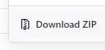

# Bem vindo ao meu repositório!

Redes Sociais:
* [Site](https://nserv.vercel.app/#/)
* [Instagram](https://www.instagram.com/nserv.informatica/)
* [Linkedin](https://www.linkedin.com/company/nserv-informatica/)

---

# Instruções de como usar este script:

 - Se já usou o github antes já deve saber como fazer o download deste arquivo.
 - Se você nunca usou o GitHub(este site) antes, veja o que fazer abaixo

# Como baixar os arquivos

1. Clique no botão verde para fazer o download

    

2. Clique em Download ZIP

    

---

# Mini-Tutorial de como usar o bot

1. Após ter feito o download dos arquivos vá até a pasta onde você fez o download e extraia o arquivo.
2. Abra o VS Code e altere o código do arquivo `BotInstagram.py`.
3. Altere os comentários padrão que estão sendo usados neste arquivo.
4. Altere a *hashtag* de acordo com sua necessidade.
5. Altere o nome do **usuário** e **senha**.
6. Altere a **quantidade de vezes** que você irá descer a página.

---

# Imagine se você pudesse:

* **Criar robôs** que trabalham por você?
* **Usar** a programação ao seu favor?
* **Economizar** dezenas de horas?
* **Monetizar** seu conhecimento?

Posso te ensinar tudo isso, entre em contato conosco.

---

## Tem sugestões/temas/tópicos/cursos?
Estou sempre aberto para sugestões, mande elas para nserv@hotmail.com
